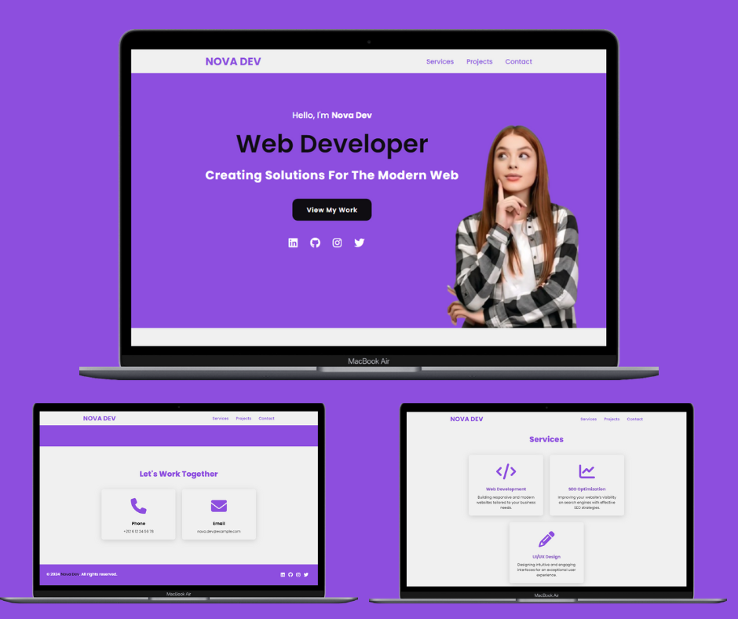
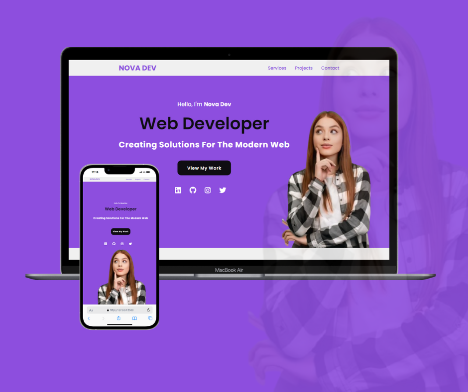

Explore the Project:
 <a href="https://portfolio-template-accessible.netlify.app/" target="_blank">portfolio-template-accessible</a>
 

    
        

# Portfolio-Template-Accessible

## Description
This is a fully customizable portfolio template that can be easily adapted to showcase your work and services. You can modify the sections, update the contact details, and replace the provided content with your own.

If you are interested in obtaining the source code or have any inquiries, feel free to contact me:
- **Email:** [Saad Barhrouj](saad.barhrouj@etu.uae.ac.ma) 📧
- **LinkedIn:** [Saad Barhrouj](https://www.linkedin.com/in/saad-barhrouj-b37270295/) 💼
- **GitHub:** [SaadBarhrouj](https://github.com/SaadBarhrouj) 🐙
-  
 <a href="https://portfolio-saad-barhrouj.netlify.app/" target="_blank">My Portfolio</a>
 

## Features
- Responsive design
- Customizable sections for services, projects, and contact
- Ready-to-use template for developers, designers, and other professionals

